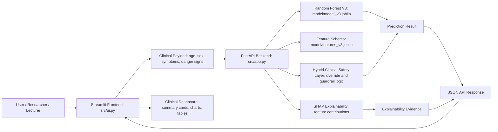

# Malaria Clinical AI

### Safety-aware explainable hybrid clinical decision support prototype for malaria severity assessment.


[Live Streamlit Demo](https://malaria-clinical-ai.streamlit.app/) | [Render Backend](https://malaria-clinical-ai.onrender.com/) | [Health Endpoint](https://malaria-clinical-ai.onrender.com/health) | [API Information](https://malaria-clinical-ai.onrender.com/info) | [GitHub Repository](https://github.com/basil-emeokoro/malaria-clinical-ai)

## Table of Contents

- [Overview](#overview)
- [Features](#features)
- [System Architecture](#system-architecture)
- [Technology Stack](#technology-stack)
- [Installation](#installation)
- [Usage](#usage)
- [Live Demo](#live-demo)
- [API Endpoints](#api-endpoints)
- [Screenshots](#screenshots)
- [Project Structure](#project-structure)
- [Explainability](#explainability)
- [SHAP](#shap)
- [Deployment](#deployment)
- [Future Improvements](#future-improvements)
- [License](#license)
- [Author](#author)

## Overview

Malaria severity assessment is a high-stakes clinical workflow where delayed escalation can increase patient risk. In many settings, early decision support must combine structured symptoms, clinician-facing explanations, and conservative safety rules rather than relying on a model probability alone.

This project implements a capstone-ready hybrid clinical decision support prototype for malaria severity prediction. It combines a Random Forest V3 machine learning model, a FastAPI backend, a Streamlit dashboard, clinical safety guardrails, and SHAP-based explainability. The system is designed for research, demonstration, and portfolio presentation, with clear separation between prediction logic, user interface, deployment assets, and reproducibility scripts.

Key innovations include:

- A hybrid model-plus-clinical-safety architecture.
- A visible safety escalation layer for severe clinical indicators.
- SHAP explainability for model transparency.
- Interactive grouped symptom selection for clinical scenario testing.
- Production-style deployment through Docker, Render, and Streamlit Community Cloud.

## Features

- ✅ Interactive Streamlit dashboard for malaria severity prediction.
- ✅ FastAPI backend with health, metadata, and prediction endpoints.
- ✅ Random Forest V3 model loaded from validated production artifacts.
- ✅ Clinical safety layer for override and guardrail behavior.
- ✅ SHAP contribution table and visual explanation support.
- ✅ Grouped symptom controls, reset controls, and select-all workflow support.
- ✅ Diagnosis summary cards for final decision, model prediction, risk level, probability, decision source, and certainty.
- ✅ Research dashboard and backend/API information tab.
- ✅ Current payload display and latest prediction evidence JSON.
- ✅ Dockerfile for local container execution and Render deployment.
- ✅ Streamlit Community Cloud entry point through `streamlit_app.py`.
- ✅ Capstone documentation, deployment guide, checklist, and demonstration notebook.

## System Architecture



The active architecture is:

- Backend: `src/app.py`
- Frontend: `src/ui.py`
- Streamlit cloud entry point: `streamlit_app.py`
- Active model artifacts: `model/model_v3.joblib` and `model/features_v3.joblib`
- Active reproducibility trainer: `src/train_v3.py`

## Technology Stack

| Layer | Technology |
| --- | --- |
| Language | Python 3.11+ |
| Machine Learning | Scikit-learn Random Forest |
| Data Processing | pandas, NumPy |
| Class Imbalance Support | imbalanced-learn |
| Explainability | SHAP |
| Visualization | Plotly, Matplotlib |
| Backend API | FastAPI, Uvicorn |
| Frontend | Streamlit |
| Serialization | joblib |
| Containerization | Docker |
| Backend Hosting | Render |
| Frontend Hosting | Streamlit Community Cloud |
| Version Control | Git, GitHub |

## Installation

### Local Virtual Environment

Use Python 3.11 or a compatible Python version with scientific Python wheel support.

```powershell
cd "C:\ADA_Data_Science\Projects\malaria-clinical-ai"
python -m venv .venv
.\.venv\Scripts\Activate.ps1
python -m pip install --upgrade pip
python -m pip install -r requirements.txt
```

### Required Model Files

The active application expects these files to be present:

```text
model/model_v3.joblib
model/features_v3.joblib
```

The active reproducibility script is:

```text
src/train_v3.py
```

Do not switch the production app to `model_v4.joblib`, `features_v4.joblib`, `train.py`, or archived experiment files unless the model is intentionally revalidated.

## Usage

### Run the Backend Locally

```powershell
cd "C:\ADA_Data_Science\Projects\malaria-clinical-ai"
.\.venv\Scripts\Activate.ps1
uvicorn src.app:app --reload
```

The backend is then available at:

```text
http://127.0.0.1:8000
```

### Run the Frontend Locally

```powershell
cd "C:\ADA_Data_Science\Projects\malaria-clinical-ai"
.\.venv\Scripts\Activate.ps1
streamlit run src/ui.py
```

The Streamlit interface opens in the browser, usually at:

```text
http://localhost:8501
```

### Example Prediction Request

```powershell
curl -X POST "http://127.0.0.1:8000/predict" `
  -H "Content-Type: application/json" `
  -d '{
    "age": 25,
    "sex": "Female",
    "fever": 1,
    "cold": 0,
    "rigor": 1,
    "fatigue": 1,
    "headache": 1,
    "bitter_tongue": 0,
    "vomiting": 0,
    "diarrhea": 0,
    "convulsion": 0,
    "anemia": 0,
    "jaundice": 0,
    "coca_cola_urine": 0,
    "hypoglycemia": 0,
    "prostration": 0,
    "hyperpyrexia": 0
  }'
```

## Live Demo

| Resource | Link |
| --- | --- |
| Streamlit Frontend | [https://malaria-clinical-ai.streamlit.app/](https://malaria-clinical-ai.streamlit.app/) |
| Render Backend | [https://malaria-clinical-ai.onrender.com/](https://malaria-clinical-ai.onrender.com/) |
| Health Endpoint | [https://malaria-clinical-ai.onrender.com/health](https://malaria-clinical-ai.onrender.com/health) |
| API Information | [https://malaria-clinical-ai.onrender.com/info](https://malaria-clinical-ai.onrender.com/info) |
| GitHub Repository | [https://github.com/basil-emeokoro/malaria-clinical-ai](https://github.com/basil-emeokoro/malaria-clinical-ai) |

Public users should normally use the Streamlit frontend link. The Render backend link is also public and useful for API testing, health checks, technical review, and integration demos.

## API Endpoints

| Method | Endpoint | Purpose |
| --- | --- | --- |
| GET | `/` | Confirms that the malaria severity prediction API is running. |
| GET | `/health` | Returns service health and model readiness status. |
| GET | `/info` | Returns model, architecture, feature, and API metadata. |
| POST | `/predict` | Accepts patient clinical inputs and returns prediction, risk, safety decision, and explainability evidence. |
| GET | `/docs` | Interactive FastAPI OpenAPI documentation when enabled by the running service. |

### Prediction Payload Fields

| Field | Type | Description |
| --- | --- | --- |
| `age` | number | Patient age. |
| `sex` | string | Patient sex, such as `Female` or `Male`. |
| `fever` | integer | Fever indicator, usually `0` or `1`. |
| `cold` | integer | Cold symptom indicator. |
| `rigor` | integer | Rigor symptom indicator. |
| `fatigue` | integer | Fatigue symptom indicator. |
| `headache` | integer | Headache symptom indicator. |
| `bitter_tongue` | integer | Bitter tongue symptom indicator. |
| `vomiting` | integer | Vomiting symptom indicator. |
| `diarrhea` | integer | Diarrhea symptom indicator. |
| `convulsion` | integer | Convulsion danger sign indicator. |
| `anemia` | integer | Anemia danger sign indicator. |
| `jaundice` | integer | Jaundice danger sign indicator. |
| `coca_cola_urine` | integer | Dark urine danger sign indicator. |
| `hypoglycemia` | integer | Hypoglycemia danger sign indicator. |
| `prostration` | integer | Prostration danger sign indicator. |
| `hyperpyrexia` | integer | Hyperpyrexia danger sign indicator. |

## Screenshots

Add public-safe screenshots under a future `screenshots/` folder when final portfolio images are selected.

### Home Page

Screenshot placeholder for the Streamlit landing area and disclaimer.

### Prediction Page

Screenshot placeholder for grouped symptom controls and diagnosis summary cards.

### Research Dashboard

Screenshot placeholder for research-oriented charts and outputs.

### SHAP Explanation

Screenshot placeholder for SHAP contribution charts and the full explanation table.

### Charts

Screenshot placeholder for model probability, risk, and explainability visualizations.

## Project Structure

```text
malaria-clinical-ai/
├── archive/
│   ├── app_production_ready.py
│   ├── train_original.py
│   ├── train_v2.py
│   ├── train_v4.py
│   └── ui_production_ready.py
├── data/
│   └── Malaria-Data.csv
├── model/
│   ├── features_v3.joblib
│   ├── model_v3.joblib
│   └── legacy model artifacts
├── notebooks/
│   └── Malaria_Hybrid_Clinical_Demo.ipynb
├── src/
│   ├── app.py
│   ├── check_labels.py
│   ├── diagnose_data.py
│   ├── train_v3.py
│   └── ui.py
├── .dockerignore
├── DEPLOYMENT.md
├── Dockerfile
├── README.md
├── requirements.txt
├── runtime.txt
├── streamlit_app.py
└── SUBMISSION_CHECKLIST.md
```

## Explainability

The dashboard is designed to make model behavior inspectable rather than opaque. The backend returns prediction evidence, and the frontend displays clinical summary cards, safety decision labels, and explainability outputs.

The interface distinguishes between:

- Model-generated probability.
- Final hybrid clinical decision.
- Risk level.
- Decision source.
- Clinical override or guardrail behavior.
- Prediction certainty.

This distinction is important because a clinical safety prototype should not hide whether a severe-risk decision came from model probability alone or from safety escalation logic.

## SHAP

SHAP is used to explain how individual clinical features influence the model's severe-risk probability. The full SHAP table presents:

| Column | Meaning |
| --- | --- |
| Clinical Feature | Human-readable clinical input name. |
| SHAP Contribution | Direction and magnitude of model contribution. |
| Effect on Model Severe-Risk Probability | Whether the feature increases or decreases severe-risk probability. |
| Clinical Status | Whether the feature is present, absent, or a baseline variable. |

SHAP outputs support transparency for supervisors, technical reviewers, and users who need to understand why a prediction was produced.

## Deployment

### Docker

Build the Docker image:

```powershell
cd "C:\ADA_Data_Science\Projects\malaria-clinical-ai"
docker build -t malaria-clinical-ai:v1 .
```

Run the container locally:

```powershell
docker run --rm -p 8010:8000 malaria-clinical-ai:v1
```

Open:

```text
http://localhost:8010/health
```

The container exposes internal port `8000`. Mapping host port `8010` to container port `8000` avoids conflicts when another local process already uses port `8000`.

### Render Backend Deployment

Render should deploy the FastAPI backend from the Dockerfile.

| Setting | Value |
| --- | --- |
| Service Type | Web Service |
| Runtime | Docker |
| Build Command | Docker build handled by Render |
| Start Command | Dockerfile `CMD` |
| Internal Port | `8000` |
| Runtime Port | `${PORT:-8000}` |

The Dockerfile uses:

```dockerfile
CMD ["sh", "-c", "uvicorn src.app:app --host 0.0.0.0 --port ${PORT:-8000}"]
```

This supports Render's dynamic `PORT` environment variable while preserving local execution.

### Streamlit Community Cloud Deployment

Use these Streamlit Community Cloud settings:

| Setting | Value |
| --- | --- |
| Repository | `basil-emeokoro/malaria-clinical-ai` |
| Branch | Default deployment branch |
| Main file path | `streamlit_app.py` |
| Python runtime | `runtime.txt` sets Python 3.11 |

The Streamlit app calls the deployed Render prediction endpoint:

```text
https://malaria-clinical-ai.onrender.com/predict
```

If the Render backend URL changes, update the API URL in `src/ui.py` and redeploy Streamlit.

## Future Improvements

- [ ] Add authentication for controlled clinical demonstration access.
- [ ] Add CI/CD validation for syntax checks, Docker build, and endpoint smoke tests.
- [ ] Add automated Streamlit UI smoke testing.
- [ ] Add model monitoring and prediction drift reporting.
- [ ] Add structured logging for API requests and clinical safety decisions.
- [ ] Expand validation on larger and more diverse malaria datasets.
- [ ] Add downloadable PDF reports for prediction evidence.
- [ ] Add versioned model cards and dataset documentation.
- [ ] Add screenshot assets for portfolio presentation.

## License

This project is intended for academic, research, demonstration, and portfolio use under the MIT License.

Research prototype disclaimer: this dashboard is not a medical device and must not be used as a final diagnosis. All outputs must be confirmed through qualified clinical evaluation and laboratory testing.

## Author

**Basil Oforbuike Emeokoro**

Psychometrician | AI & Machine Learning Engineer | Explainable AI Researcher | Data Scientist | Educational Assessment Researcher

GitHub:

[https://github.com/basil-emeokoro](https://github.com/basil-emeokoro)

LinkedIn:

[https://www.linkedin.com/in/basil-emeokoro](https://www.linkedin.com/in/basil-emeokoro)
