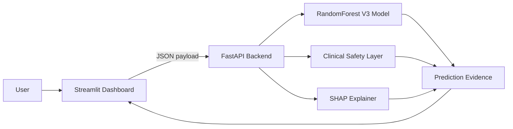

# Malaria Clinical AI

## Safety-Aware Explainable Hybrid Clinical Decision Support Prototype

[](https://www.python.org/)
[](#technology-stack)
[](#explainability)
[](https://fastapi.tiangolo.com/)
[](https://streamlit.io/)
[](https://www.docker.com/)
[](https://render.com/)
[](https://scikit-learn.org/)
[](https://pandas.pydata.org/)
[](https://numpy.org/)
[](https://github.com/basil-emeokoro/malaria-clinical-ai)

Research prototype for malaria severity decision support using **FastAPI**, **Streamlit**, **RandomForest V3**, a rule-based **clinical safety layer**, and **SHAP explainability**.

<p>
  <a href="https://malaria-clinical-ai.streamlit.app/"><strong>Live Demo</strong></a>
  &nbsp;|&nbsp;
  <a href="https://github.com/basil-emeokoro/malaria-clinical-ai"><strong>GitHub Repository</strong></a>
  &nbsp;|&nbsp;
  <a href="https://malaria-clinical-ai.onrender.com/health"><strong>Backend Health Check</strong></a>
</p>

---

## Table of Contents

- [Overview](#overview)
- [Features](#features)
- [System Architecture](#system-architecture)
- [Technology Stack](#technology-stack)
- [Installation](#installation)
- [Usage](#usage)
- [Live Demo](#live-demo)
- [API Endpoints](#api-endpoints)
- [Screenshots](#screenshots)
- [Project Structure](#project-structure)
- [Explainability](#explainability)
- [Deployment](#deployment)
- [Future Improvements](#future-improvements)
- [License](#license)
- [Author](#author)

---

## Overview

Malaria remains a major clinical and public health challenge, especially where rapid identification of severe-risk cases can influence escalation of care. Symptom-based assessment can be noisy and uncertain, while purely statistical machine learning models may miss clinically important warning signs.

**Malaria Clinical AI** addresses this problem by combining model-based severity estimation with a transparent clinical safety layer. The application allows users to enter patient demographic and symptom information, receive a severity-risk assessment, inspect the model probability, and review SHAP-based explanations of the machine learning output.

Key innovations include:

- A deployed RandomForest V3 model for malaria severity prediction.
- A hybrid clinical safety layer that distinguishes model probability, baseline clinical assessment, safety escalation, and safety confirmation.
- SHAP explanations for transparent feature-level interpretation.
- A full-stack deployment workflow using FastAPI, Streamlit, Docker, Render, and Streamlit Community Cloud.

> **Research disclaimer:** This dashboard is for academic, research, and demonstration use only. It is not a medical device and must not be used as a final diagnosis. Always confirm with qualified clinical evaluation and laboratory testing.

---

## Features

- ✅ Explainable AI with SHAP feature contributions.
- ✅ Interactive Streamlit dashboard for symptom entry and clinical review.
- ✅ FastAPI REST backend for structured prediction requests.
- ✅ RandomForest V3 model with active feature schema.
- ✅ Clinical safety layer for critical malaria indicators.
- ✅ Diagnosis summary cards and clinical recommendation panels.
- ✅ Full SHAP charts, ranked tables, and evidence JSON.
- ✅ Docker backend support for local and Render deployment.
- ✅ Streamlit Community Cloud frontend deployment.
- ✅ Demonstration notebook for lecturer review and portfolio presentation.
- ✅ Reproducibility script: `src/train_v3.py`.

---

## System Architecture

The current production architecture is:

- **Backend:** `src/app.py`
- **Frontend:** `src/ui.py`
- **Streamlit Cloud entrypoint:** `streamlit_app.py`
- **Model:** RandomForest V3
- **Model artifacts:** `model/model_v3.joblib`, `model/features_v3.joblib`
- **Active trainer:** `src/train_v3.py`
- **Explainability:** SHAP TreeExplainer
- **Clinical safety layer:** rule-based safety assessment layered on model probability

The active backend uses the V3 model artifacts. The project should not be switched to V4, `pipeline.joblib`, or archived original Flask/training files unless retraining and revalidation are intentionally performed.



---

## Technology Stack

| Layer | Technology |
| --- | --- |
| Language | Python 3.11 |
| Machine Learning | Scikit-learn RandomForestClassifier |
| Data Processing | Pandas, NumPy |
| Explainability | SHAP |
| API | FastAPI, Uvicorn |
| Frontend | Streamlit, Plotly |
| Containerization | Docker |
| Backend Deployment | Render |
| Frontend Deployment | Streamlit Community Cloud |
| Version Control | Git, GitHub |
| Reproducibility | Joblib model artifacts, `src/train_v3.py` |

---

## Installation

### Local Environment

```powershell
git clone https://github.com/basil-emeokoro/malaria-clinical-ai.git
cd malaria-clinical-ai

python -m venv venv
.\venv\Scripts\activate
pip install -r requirements.txt
```

### Required Model Files

The following active model files must be present:

```text
model/model_v3.joblib
model/features_v3.joblib
```

---

## Usage

### Run Backend Locally

```powershell
uvicorn src.app:app --reload
```

Backend default URL:

```text
http://127.0.0.1:8000
```

### Run Frontend Locally

```powershell
streamlit run src/ui.py
```

### Runtime Note

The hosted Streamlit deployment uses Python 3.11 via `runtime.txt` for compatibility with the scientific Python stack.

---

## Live Demo

| Service | URL | Purpose |
| --- | --- | --- |
| Streamlit Application | <https://malaria-clinical-ai.streamlit.app/> | Full user-facing dashboard |
| Render Backend | <https://malaria-clinical-ai.onrender.com/> | FastAPI backend root |
| Health Endpoint | <https://malaria-clinical-ai.onrender.com/health> | Backend deployment health check |
| API Information | <https://malaria-clinical-ai.onrender.com/info> | Model/API metadata |

For public demonstrations, the recommended primary link is the Streamlit application. The Render link is useful for technical API validation.

---

## API Endpoints

| Method | Endpoint | Description |
| --- | --- | --- |
| `GET` | `/` | API root status |
| `GET` | `/health` | Health check and model status |
| `GET` | `/info` | Model architecture and feature schema |
| `POST` | `/predict` | Malaria severity prediction with explainability evidence |

Example `/predict` payload:

```json
{
  "age": 25,
  "sex": 0,
  "fever": 1,
  "cold": 0,
  "rigor": 1,
  "fatigue": 1,
  "headache": 1,
  "bitter_tongue": 0,
  "vomiting": 0,
  "diarrhea": 1,
  "convulsion": 0,
  "anemia": 0,
  "jaundice": 0,
  "coca_cola_urine": 0,
  "hypoglycemia": 0,
  "prostration": 0,
  "hyperpyrexia": 0
}
```

Example API test:

```powershell
curl https://malaria-clinical-ai.onrender.com/health
curl https://malaria-clinical-ai.onrender.com/info
```

---

## Screenshots

### Home Page

<!-- Insert screenshot: dashboard home / hero section -->

### Prediction Page

<!-- Insert screenshot: patient clinical information and symptom selection -->

### Diagnosis Dashboard

<!-- Insert screenshot: diagnosis summary cards and clinical recommendations -->

### SHAP Explanation

<!-- Insert screenshot: SHAP chart and full SHAP table -->

### Research Dashboard / Evidence JSON

<!-- Insert screenshot: latest prediction evidence JSON -->

---

## Project Structure

```text
malaria-clinical-ai/
├── archive/
│   ├── app_production_ready.py
│   ├── train_original.py
│   ├── train_v2.py
│   ├── train_v4.py
│   └── ui_production_ready.py
├── data/
│   └── Malaria-Data.csv
├── model/
│   ├── model_v3.joblib
│   ├── features_v3.joblib
│   └── ... archived model artifacts
├── notebooks/
│   └── Malaria_Hybrid_Clinical_Demo.ipynb
├── src/
│   ├── app.py
│   ├── ui.py
│   ├── train_v3.py
│   ├── diagnose_data.py
│   └── check_labels.py
├── .dockerignore
├── Dockerfile
├── DEPLOYMENT.md
├── README.md
├── requirements.txt
├── runtime.txt
├── streamlit_app.py
└── SUBMISSION_CHECKLIST.md
```

---

## Explainability

The project uses SHAP to explain the machine learning probability layer. SHAP values show how individual features influence the estimated severe malaria probability.

The dashboard includes:

- Feature contribution charts.
- Ranked SHAP tables.
- Clinical feature status labels.
- Explanation summaries.
- Evidence JSON for audit-friendly review.

The clinical safety layer is reported separately from SHAP because it is a rule-based decision-support layer, not part of the model probability calculation. This separation improves transparency by showing when the final decision came from model probability, baseline clinical assessment, safety escalation, or safety confirmation.

---

## Deployment

### Docker Backend

Build:

```powershell
docker build -t malaria-clinical-ai:v1 .
```

Run:

```powershell
docker run --rm -p 8000:8000 malaria-clinical-ai:v1
```

If local port `8000` is occupied, keep the container port at `8000` and use a different host port:

```powershell
docker run --rm -p 8010:8000 malaria-clinical-ai:v1
```

The container exposes internal port `8000`, preserving Render compatibility.

### Render Backend Deployment

Recommended Render settings:

```text
Runtime: Docker
Build Command: Dockerfile managed by Render
Start Command: Dockerfile CMD
Environment Variables: none required for backend; Render supplies PORT automatically
```

Dockerfile command:

```dockerfile
CMD ["sh", "-c", "uvicorn src.app:app --host 0.0.0.0 --port ${PORT:-8000}"]
```

### Streamlit Community Cloud Deployment

Streamlit deployment settings:

```text
Repository: basil-emeokoro/malaria-clinical-ai
Branch: production-ui-polish
Main file path: streamlit_app.py
Python runtime: python-3.11
```

The hosted frontend calls the Render backend through:

```python
API_URL = "https://malaria-clinical-ai.onrender.com/predict"
```

---

## Future Improvements

- [ ] Add user authentication for controlled clinical demonstrations.
- [ ] Add CI/CD checks for Python syntax, Docker build, and endpoint smoke tests.
- [ ] Add model monitoring and drift detection.
- [ ] Expand the dataset and validate performance across more sites.
- [ ] Add calibration plots and confidence interval reporting.
- [ ] Improve explainability with cohort-level analytics.
- [ ] Add automated screenshot generation for documentation.
- [ ] Explore Kubernetes or managed container orchestration for advanced deployment.
- [ ] Add a formal model card and dataset card.

---

## License

This project is intended for academic, research, and portfolio demonstration. An MIT License is appropriate if open-source reuse is desired. Add a `LICENSE` file before distributing under a formal open-source license.

---

## Author

**Basil Oforbuike Emeokoro**

Psychometrician | AI & Machine Learning Engineer | Explainable AI Researcher | Data Scientist | Educational Assessment Researcher

GitHub: <https://github.com/basil-emeokoro>

LinkedIn: *(placeholder - add profile URL when available)*

---

## Citation / Academic Use

If this project is referenced in academic or portfolio contexts, cite it as a capstone research prototype for safety-aware explainable hybrid clinical decision support in malaria severity assessment.
